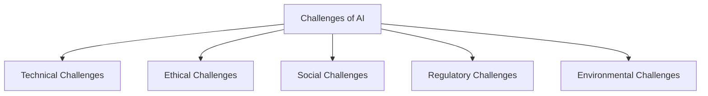
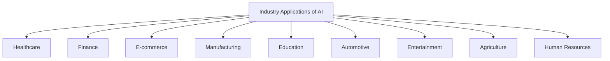
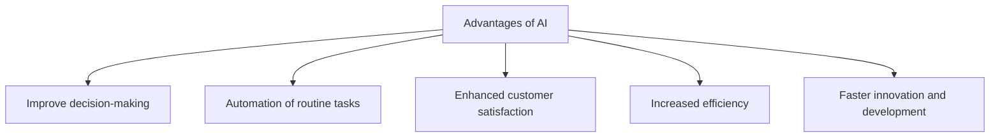
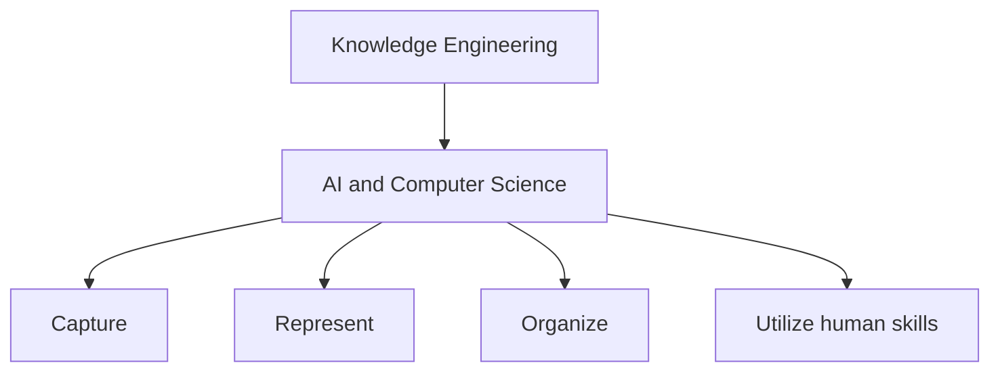
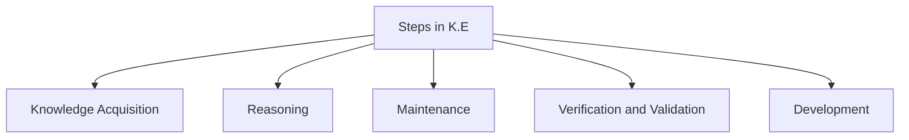
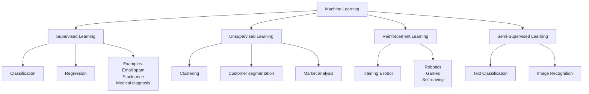
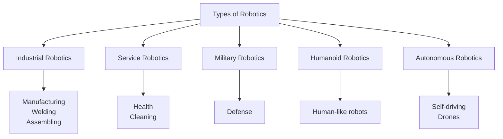
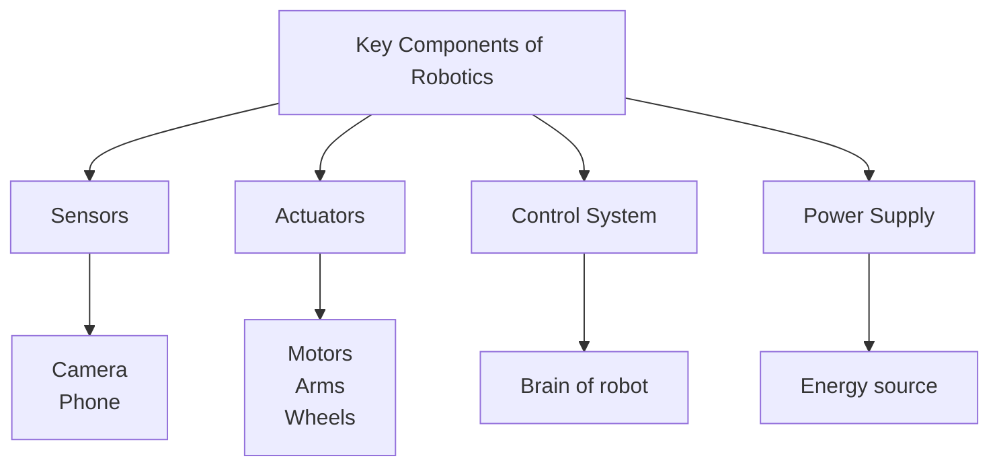
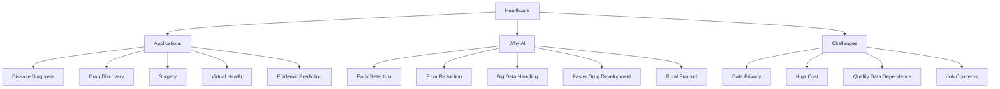
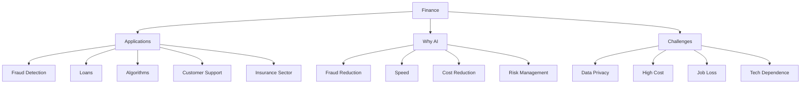

> [!info]
> Ironically this very doc was made by AI. I have just added "better/right" examples because the original ones werereferring Software 'Apps' instead AI.

# Unit-I

**1. Challenges of AI**



**2. Industry Applications of AI**



**3. Advantages of AI**



**3. Knowledge Engineering**



**Steps in Knowledge Engineering**


**4. Machine Learning**

**Machine Learning Definition**
It is a branch of AI that allows computers to automatically learn from data.

**Types of ML**



**5. Robotics**

**Types of Robotics**


**Key Components of Robotics**



# Unit-II

**1. Healthcare**


**2. Finance**




**3. Retail**

```mermaid
flowchart TD
    A[Retail]

    A --> B[Why AI?]
    B --> B1[Personalized Shopping]
    B --> B2[Inventory Management]
    B --> B3[Fraud Prevention]
    B --> B4[Faster Customer Support]
    B --> B5[Improved Decision Making]

    A --> C[Applications]
    C --> C1[Product Recommendation]
    C --> C2[Customer Service (24/7)]
    C --> C3[Supply Chain Management]
    C --> C4[Dynamic Pricing]
    C --> C5[Fraud Detection]

    A --> D[Challenges]
    D --> D1[High Cost]
    D --> D2[Job Concerns]
    D --> D3[Data Privacy]
    D --> D4[Customer Trust]
    D --> D5[Dependence on Internet]
```

**4. Agriculture**

```mermaid
flowchart TD
    A[Agriculture]

    A --> B[Why AI?]
    B --> B1[Smart Farming]
    B --> B2[Disease Detection]
    B --> B3[Weather Prediction]
    B --> B4[Soil & Crop Monitoring]
    B --> B5[Market Price Prediction]

    A --> C[Applications]
    C --> C1[Crop Monitor (Plantix)]
    C --> C2[Precision Farming (Smart Irrigation)]
    C --> C3[Weather Prediction (IBM)]
    C --> C4[Robotic Farming]
    C --> C5[Livestock Monitoring]

    A --> D[Challenges]
    D --> D1[High Cost]
    D --> D2[Job Concerns]
    D --> D3[Data Privacy]
    D --> D4[Customer Trust]
    D --> D5[Dependence on Internet]
```


**5. Education**

```mermaid
flowchart TD
    A[Education]

    A --> B[Why AI?]
    B --> B1[Personalized Learning]
    B --> B2[24/7 Availability]
    B --> B3[Quick Assessment]
    B --> B4[Bridging Gaps]
    B --> B5[Reducing Teacher Workload]

    A --> C[Applications]
    C --> C1[Personalized Learning Apps]
    C --> C2[Intelligent Tutoring (Duolingo)]
    C --> C3[Automated Grading]
    C --> C4[Virtual Classrooms / Chatbots]
    C --> C5[Special Education Support]

    A --> D[Challenges]
    D --> D1[Job Loss]
    D --> D2[High Cost]
    D --> D3[Digital Divide]
    D --> D4[Reduced Human Interaction]
    D --> D5[Dependence on Technology]
    D --> D6[Data Privacy]
```

**6. Transport**

```mermaid
flowchart TD
    A[Transport]

    A --> B[Why AI?]
    B --> B1[Traffic is Complex]
    B --> B2[Safety is Important]
    B --> B3[Efficiency Needed]
    B --> B4[Future Transport System]

    A --> C[Applications]
    C --> C1[Self-Driving Vehicles]
    C --> C2[Traffic Management Systems]
    C --> C3[Air Transport Automation]
    C --> C4[Railway Automation]
    C --> C5[Smart Transport (Drones)]

    A --> D[Challenges]
    D --> D1[Job Loss]
    D --> D2[High Cost]
    D --> D3[Digital Divide]
    D --> D4[Dependence on Technology]
    D --> D5[Data Privacy]
```

