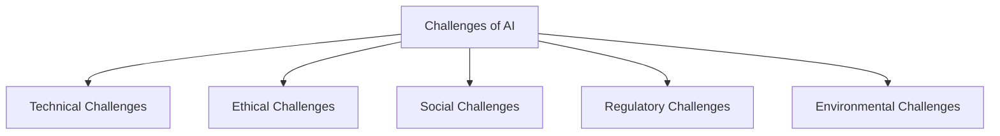
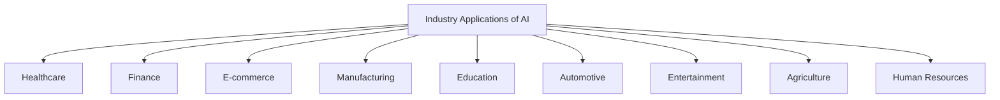
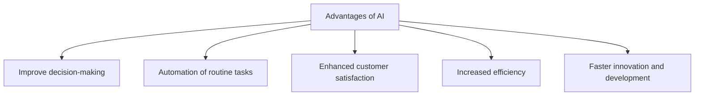
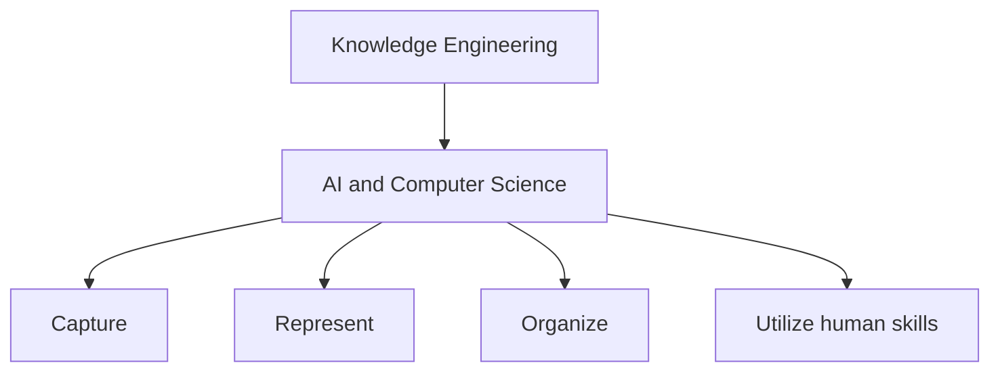
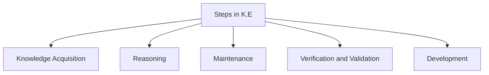
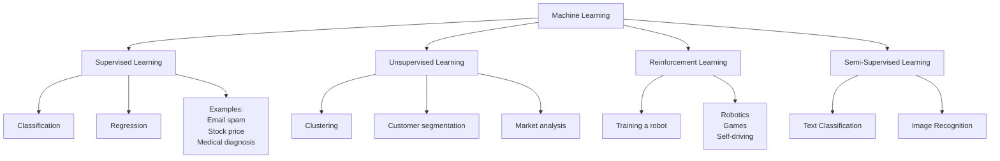
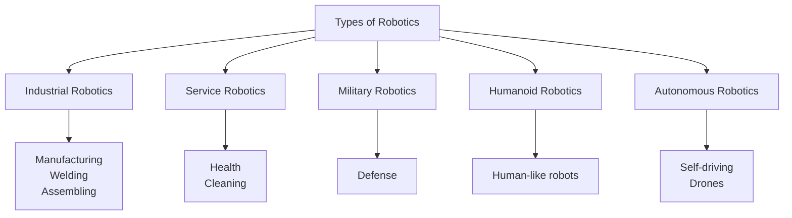
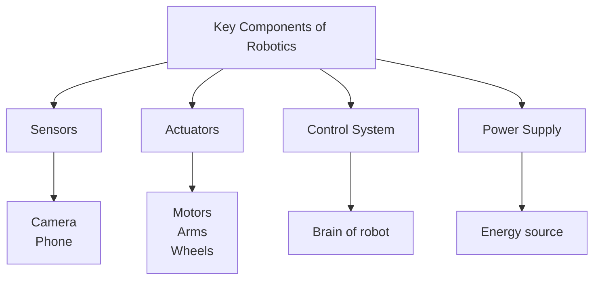

> [!info]
> j Ironically this very doc was made by AI. I have just added "better/right" examples because the original ones for referring Software 'Apps' instead AI.

# Unit-I

**1. Challenges of AI**



**2. Industry Applications of AI**



**3. Advantages of AI**



**3. Knowledge Engineering**



**Steps in Knowledge Engineering**


**4. Machine Learning**

**Machine Learning Definition**
It is a branch of AI that allows computers to automatically learn from data.

**Types of ML**



**5. Robotics**

**Types of Robotics**


**Key Components of Robotics**



# Unit-II

**1. Healthcare**

```mermaid
mindmap
  root((Healthcare))
    Applications
      "Disease Diagnosis (X-rays)"
      "Drug Discovery"
      "Surgery"
      "Virtual Health"
      "Epidemic"
    "Why AI?"
      "Early Disease Detection"
      "Error Reduction"
      "Handling Big Data"
      "Faster Drug Development"
      "Support in Rural Areas"
    Challenges
      "Data Privacy"
      "High Cost"
      "Dependence on Quality Data"
      "Job Concerns"
```

---

**2️. Finance**

```mermaid
mindmap
  root((Finance))
    Applications
      "Fraud Detection"
      "Loans"
      "Algorithms"
      "Customer Support (SBI Yono)"
      "Insurance Industry"
    "Why AI?"
      "Fraud ↓"
      "Speed"
      "Cost Reduction"
      "Risk Management"
    Challenges
      "Data Privacy"
      "High Cost"
      "Job Loss"
      "Dependence on Technology"
```


**3️. Retail**

```mermaid
mindmap
  root((Retail))
    "Why AI?"
      "Personalized Shopping"
      "Better Inventory Management"
      "Fraud Prevention"
      "Faster Customer Support"
      "Improved Decision Making"
    Applications
      "Product Recommendation (Amazon, Flipkart)"
      "Customer Service (24/7, tracking, refunds)"
      "Supply Chain Management"
      "Dynamic Pricing (Airlines, Hotels)"
      "Fraud Detection (Fake Orders)"
    Challenges
      "High Cost"
      "Job Concerns"
      "Data Privacy"
      "Customer Trust"
      "Dependence on Internet"
```

**4️. Agriculture**

```mermaid
mindmap
  root((Agriculture))
    "Why AI?"
      "Smart Farming"
      "Disease Detection"
      "Weather Prediction"
      "Soil & Crop Monitoring"
      "Market Price Prediction"
    Applications
      "Crop Monitor (Plantix)"
      "Precision Farming (Smart Irrigation)"
      "Weather & Import Prediction (IBM)"
      "Robotic Farming"
      "Livestock Monitoring"
    Challenges
      "High Cost"
      "Job Concerns"
      "Data Privacy"
      "Customer Trust"
      "Dependence on Internet"
```

**5️. Education**

```mermaid
mindmap
  root((Education))
    "Why AI?"
      "Personalized Learning"
      "24/7 Availability"
      "Quick Assessment"
      "Bridging Gaps"
      "Reducing Teacher Workload"
    Applications
      "Personalized Learning (BYJU’S, Khan Academy)"
      "Intelligent Tutoring (Duolingo)"
      "Automated Grading"
      "Virtual Classroom / Chatbots"
      "Special Education Support (Text-to-Speech)"
    Challenges
      "Job Loss"
      "High Cost"
      "Digital Divide"
      "Reduced Human Interaction"
      "Dependence on Technology"
      "Data Privacy"
```

---

**6️. Transport**

```mermaid
mindmap
  root((Transport))
    "Why AI?"
      "Traffic is Complex"
      "Safety is Important"
      "Efficiency is Needed"
      "Future Transport System"
    Applications
      "Self Driving (Tesla, Google)"
      "Traffic Management Systems"
      "Air Transport (boarding, luggage)"
      "Railways (ticketing, support)"
      "Smart Transport (Amazon Drones)"
    Challenges
      "Job Loss"
      "High Cost"
      "Digital Divide"
      "Dependence on Technology"
      "Data Privacy"
```


