i
> [!info]
> Ironically this very doc was made by AI.

# Unit-I

**1. Challenges of AI**

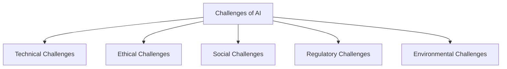

**2. Industry Applications of AI**

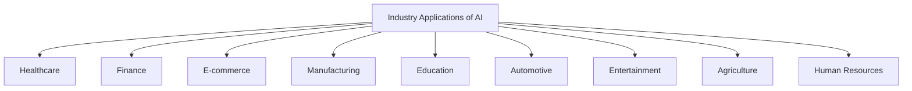

**3. Advantages of AI**

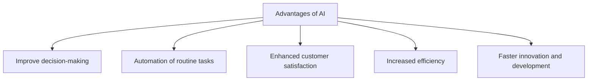

**3. Knowledge Engineering**

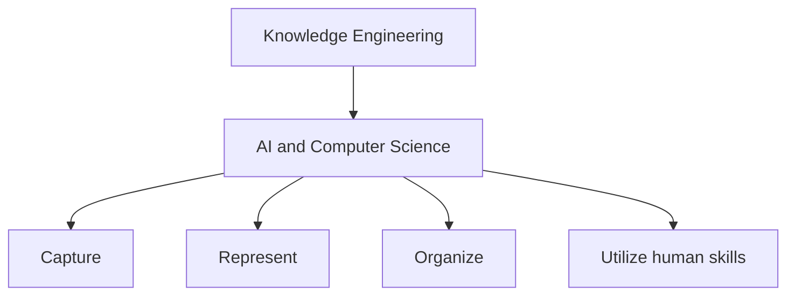

**Steps in Knowledge Engineering**

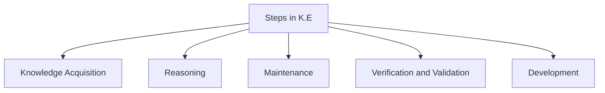
**4. Machine Learning**

**Machine Learning Definition**
It is a branch of AI that allows computers to automatically learn from data.

**Types of ML**

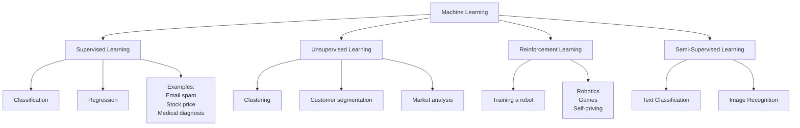

**5. Robotics**

**Types of Robotics**
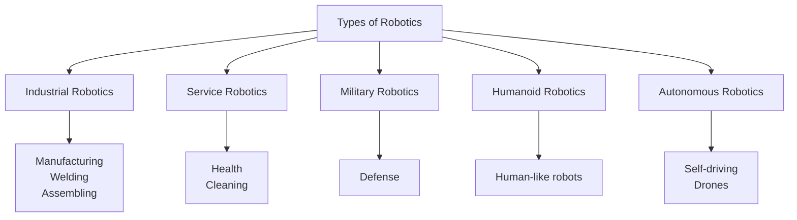

**Key Components of Robotics**

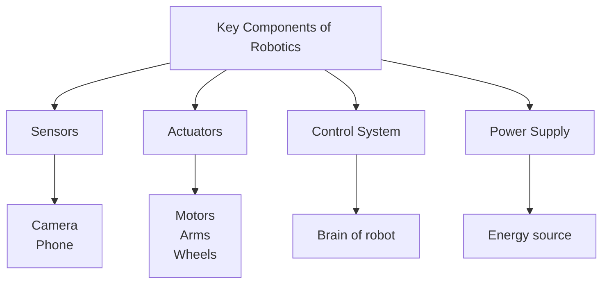

# Unit–II

**1. Healthcare**

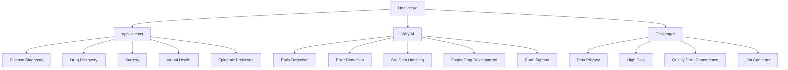

---

**2. Finance**

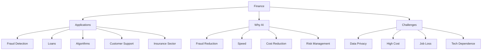

---

**3. Retail**

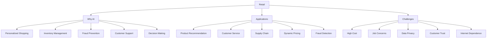

---

**4. Agriculture**

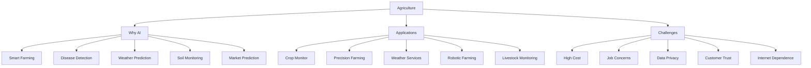

---

**5. Education**

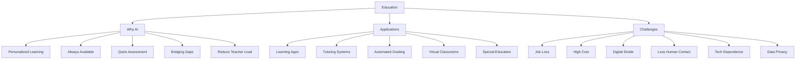

---

**6. Transport**

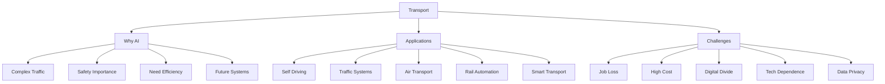

**7. Others**

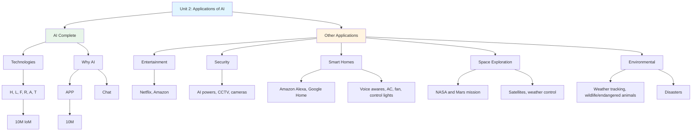

[Source](https://limewire.com/d/MlQsa#2EwkWlOVYF)

# Unit-III
