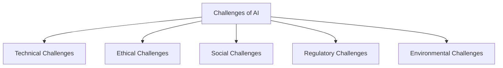
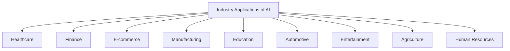
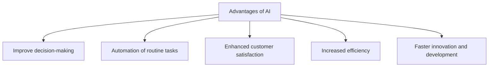
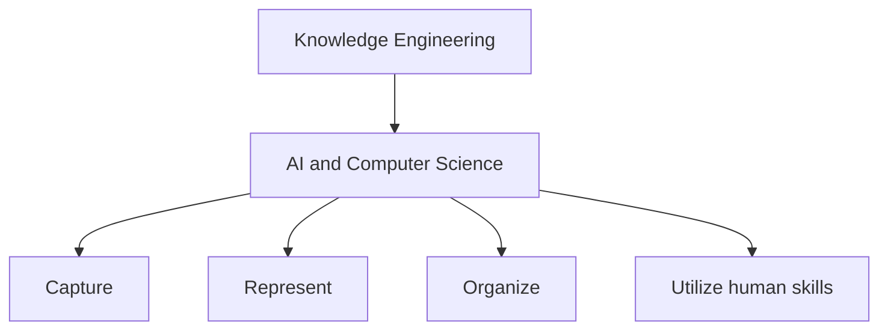
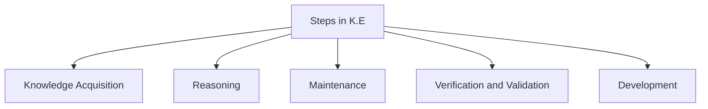
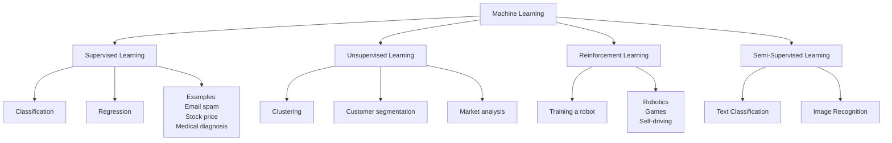
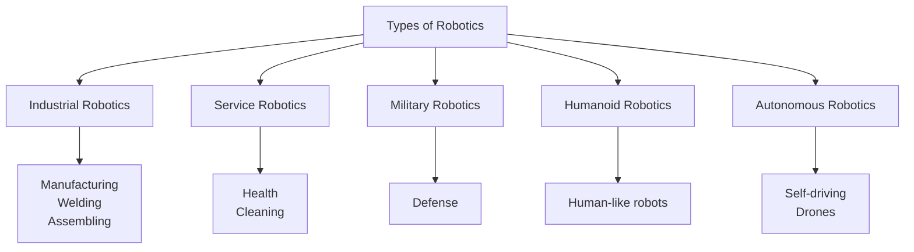
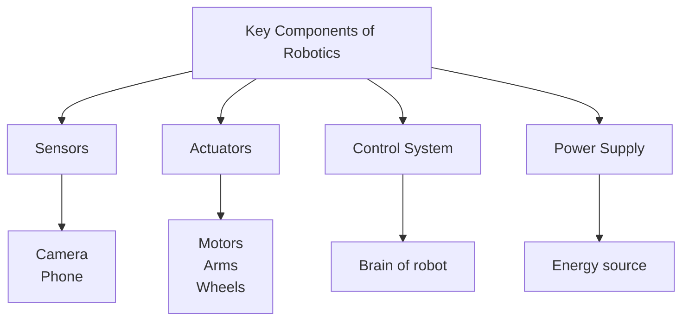

> [!info]
> This was generated using Gen AI. Please see source at the end.

---

# **1. Challenges of AI**

### **Challenges of AI — Diagram**

---

## **2. Industry Applications of AI**

**Date: 18/1/25**

### **Industry Applications of AI — Diagram**

### **Advantages of AI**

---

## **3. Knowledge Engineering**

**Date: 18/1/25**

### **Knowledge Engineering — Diagram**

### **Steps in Knowledge Engineering**

---

## **4. Machine Learning**

**Date: 19/1/25**

### **Machine Learning — Definition**

*It is a branch of AI that allows computers to automatically learn from data.*

### **Types of Machine Learning — Diagram**

---

## **5. Robotics**

**Date: 20/1/25**

### **Types of Robotics — Diagram**

### **Key Components of Robotics — Diagram**

