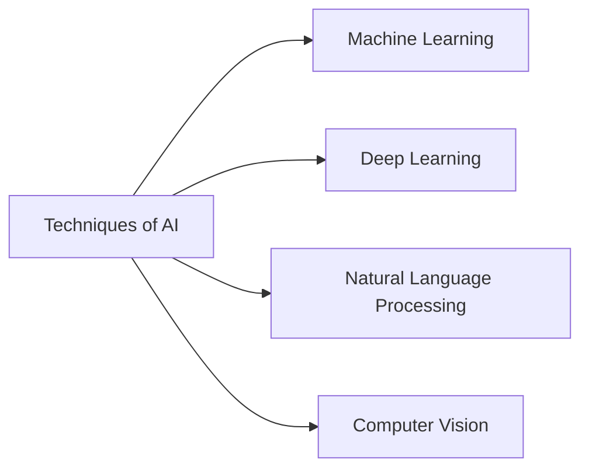
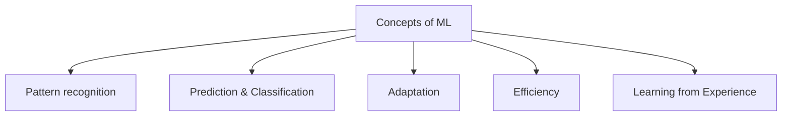
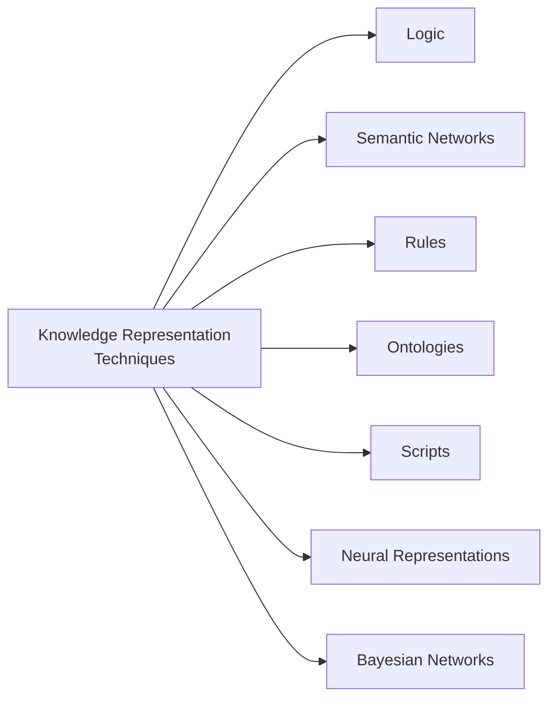
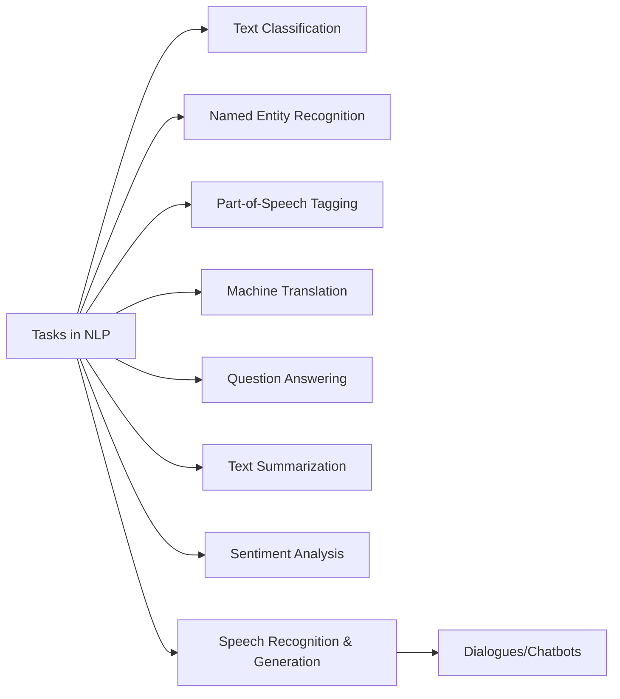
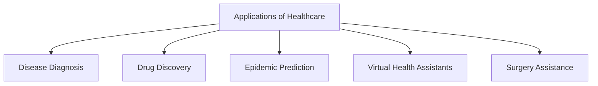

# Mid AI

# Q1. What is AI and It's types?
Ans:**Definition**
Artificial intelligence is a broad and rapidly evolving field of computer science focused on designing and building machines that can perform tasks that normally require human intelligence (learning, decision making, problem solving, language understanding).
**Types of AI** 
```mermaid
flowchart TD
  A[Types of AI]
  A --> B[Narrow AI\n(Weak AI)]
  A --> C[General AI\n(Strong AI)]
  A --> D[Super AI]
```

**Techniques of AI**


# Q2. Explain the concepts of computer vision?
Ans: Computer vision: field of AI & CS that enables computers to interpret, analyze, and understand visual information (images / video) similar to human vision.

Common tasks:
- Image classification — assigning a label to an entire image (e.g., cat, dog)
- Object detection — identifying & locating objects with bounding boxes
- Image segmentation — dividing an image into meaningful regions (semantic / instance)
- Face recognition — identifying/verifying a person from facial images
- OCR (optical character recognition) — converting printed/handwritten text into machine-readable text
- Pose estimation — detecting human body keypoints and posture
- Image generation / enhancement — super-resolution, inpainting, style transfer

# Q3. What is Machine Learning (ML)? Explain it's role in AI.
Ans:
**Definition**
Machine learning is a branch of AI that allows computers to automatically learn from data and improve their performance on tasks without being explicitly programmed.

**Concepts of ML:**


# LONG Q1. Write a short note on Knowledge Engineering it's importance to AI System?

**Definition**
Knowledge engineering is a branch of AI & CS dedicated to the design, development and maintenance of knowledge-based systems. Its primary objective is to capture, represent, organize, and utilize human expertise and domain-specific knowledge in machine-readable form.

**Knowledge representation topics**



# LONG Q2. What are the Applications AI in Education.

Education = process of learning and teaching knowledge, skills, values. AI helps education become more:
* **Personalized** — each student gets customized learning material
* **Accessible** — students can learn anytime, anywhere
* **Efficient** — teachers save time in grading/administration

**AI in Education** 


---

## LONG Q3. What are the Advantages & Disadvantages of AI.

| Advantages | Disadvantages |
|-----------|---------------|
| Increased efficiency & speed | Job displacement |
| Improved accuracy | High costs |
| 24/7 availability | Lack of creativity & emotion |
| Enhanced decision making | Ethical concerns & bias |
| Cost savings | Privacy & security risks |
| Personalization | Reliance on technology |


# SHORT Q4. Natural Language Processing (NLP) (pages 5–6)

**Definition** NLP is a branch of AI & linguistics enabling computers to comprehend, interpret, generate, and interact with human languages.

**Common preprocessing steps**:
* Lowercasing
* Tokenization
* Stop-word removal
* Punctuation removal
* Numeric & special-character removal
* Whitespace trimming
* Handling HTML tags
* Removing URLs and email addresses
* Encoding/decoding

**Tasks in NLP** (timeline / horizontal list on page 6)


---

# SHORT Q5. Healthcare Applications (pages 6–7)

Ans: **Healthcare** = care of people's health through diagnosis, treatment, prevention.

**Applications of AI in Healthcare**:



# SHORT Q6. How is AI used for Fraud Detection in Finance.

**Finance**: managing money — saving, investing, lending, borrowing, spending.

**Common fraud types listed**:
* Credit card fraud
* Account takeover
* Payment fraud
* Money laundering
* Financial statement fraud
* Identity theft
