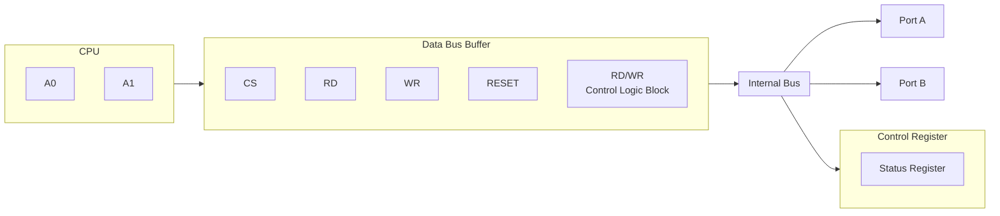
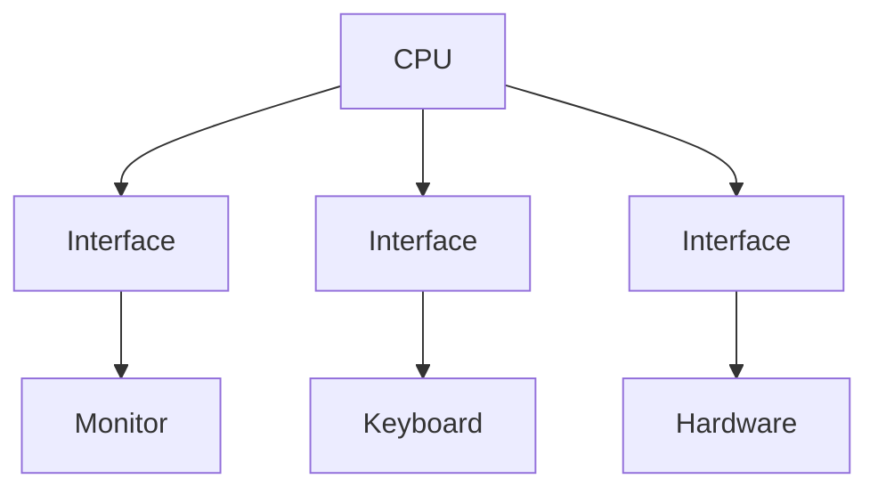
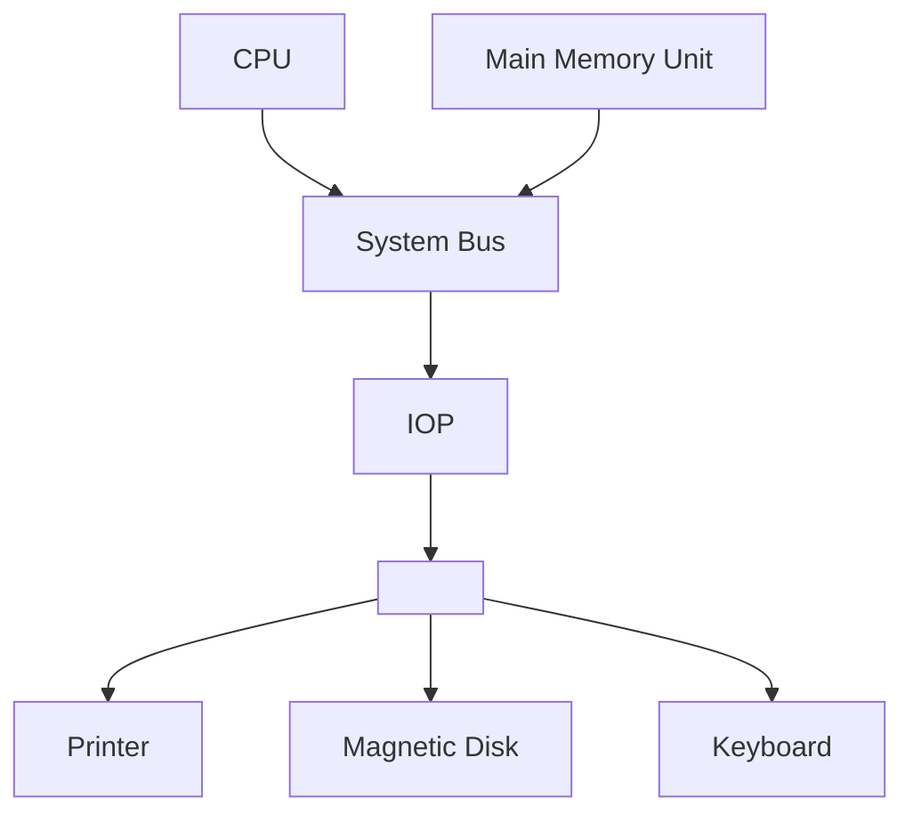
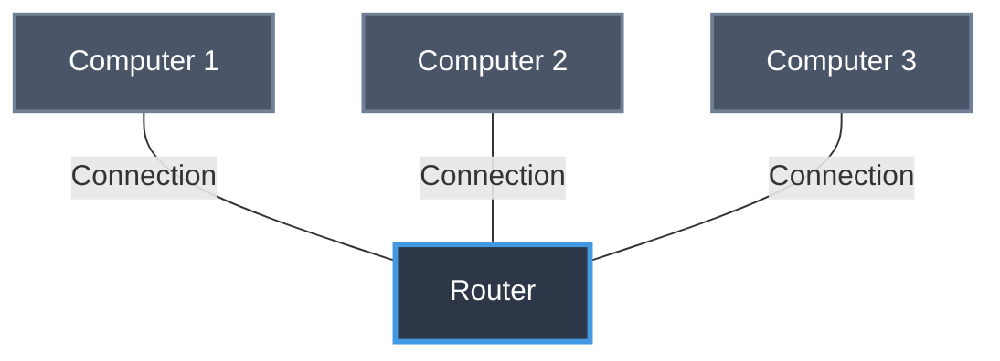
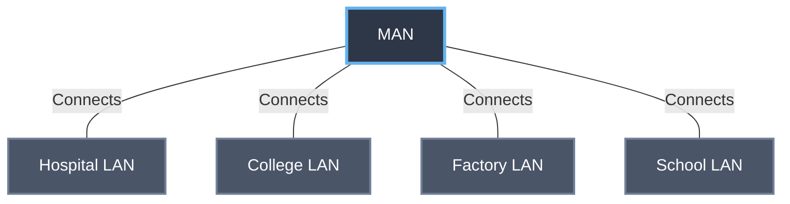
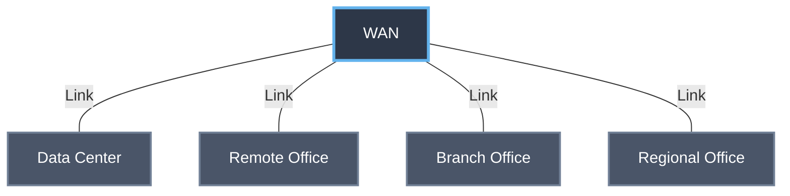
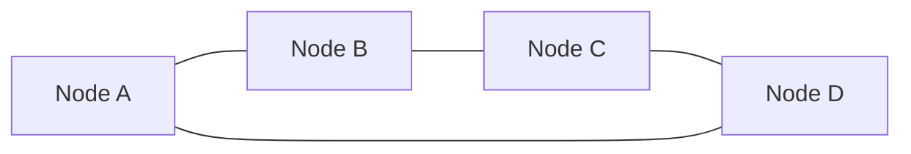
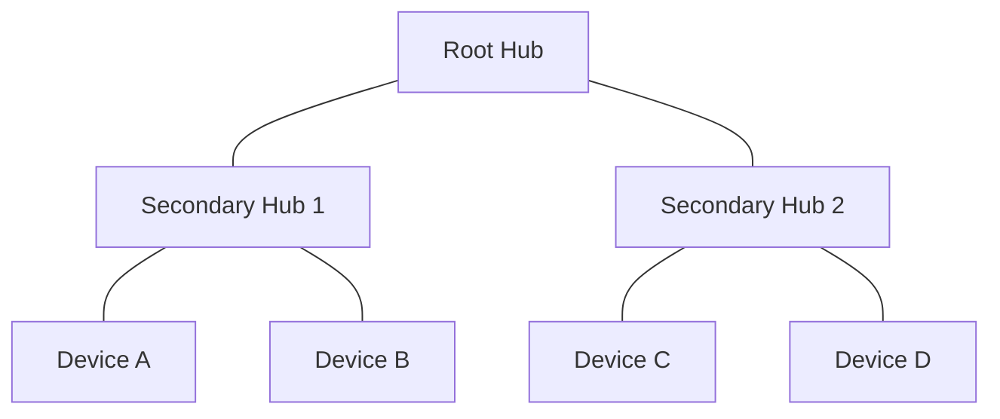

# Unit 2. Basic organisation and Networking fundamentals
- Computer Organization: Functional components – Input/Output devices, Storage types, Memory hierarchy.
- Types of Computers: Micro, Mini, Mainframe, and Supercomputers.
- Networking Fundamentals: Definition, need for networks, types (LAN, WAN, MAN), topology (Star, Ring, Bus).
- Internet Basics: IP Address, Domain Name, Web Browser, Email, WWW.

# Computer Organization
Computer Organization refers to the operational structure of a Computer system. It explains how hardware components work, how they communicate with each other, and how a Computer execute instructions internally.

C.O includes functional units of Computer: 
- Input unit, Output unit, CPU, Memory, Storage devices.
- Number System:
- Binary (2)
- Octal (8)
- Decimal (10)
- Hexadecimal (16)
- Conversions and Complements.
> [!tip]
> (xx) = base.
- Memory Organization: 
- RAM
- ROM
- Cache
- Memory Hierarchy



CPU Organisation:
1. Registers
2. Instruction Cycle
3. Addressing Modes
4. Instruction formats

Data transfer and Control:
1. Control System
2. Bus Control System

# Functional Components

1. Input devices:
* Takes data & instructions from the user & external environment
* Converts them into a machine readable (Binary format 1’s and 0’s.)
* Sends the converted data to the computer's memory or processor.
> [!example]
> Keyboard, Mouse, Scanner, Microphone, Touch screen.

2. Output Unit
* Takes processed results from the computer.
* Converts Machine readable data into a human understandable form.
* Displays *or* Outputs the data.
> [!example]
> Monitor, Printer, Speakers, Projector etc.

3. Storage/memory Unit:
Used to store ++data and instructions either temporarily or permanently.++ It is of 2 types:
1. Primary Storage: ++Fast, directly accessible by CPU.++
> [!example]
> RAM and ROM.
2. Secondary Storage: ++Large Capacity, Slower not directly accessed by CPU.++
> [!example]
> HDD, SSD, SD cards.
4. Central Processing Unit (CPU) ==++The CPU is the brain of the computer++==

It has 2 major Sub-units:
I. Arithmetic Logic Unit (ALU): Performs Arithmetic operations and Logical operations. Arithmetic: -, +, \, x. Logic (AND, OR, NOT, Comparisons) and & !.

II. Control Unit:
- Controls and Coordinates all Components.
- Fetches, decodes and executes instructions.
- Maintain the sequence of operations.

III. Registers: Smallest and fastest memory locations in CPU temporarily hold data, instructions, addresses.
> [!example]
> PC, ACC, Instructions Register (IR).

IV. Interfaces:
Since CPU and I/O devices work at different speeds but interface helps in communication Components.
1. I/O Module
2. Buffer
3. Control Signals

I/O Functions:
1. Communication Bridge
2. Speed and Synchronization
3. Data Conversion
4. Control & Management
5. Error Checking


I/O Techniques
1. Programmed I/O
2. Interrupt-driven 
3. DMA.

I. Programmed I/O:
* The CPU executes every instructions for an I/O operation.
* The CPU must continuously Poll or check, the status of a device to see if it is ready to transfer data.

II. Interrupt-driven I/O:
- The CPU issues a command & then moves on the other tasks.
- When the I/O device ready to transfer data, it sends an interrupt signal to the CPU.

III. D.M.A:
- Refers to ++Direct Memory Access++
- A dedicated DMA Controller handles the transfer of data ++between devices & memory, by passing the CPU entirely for the transfer itself.++
- This is the most efficient method for large data transfers, as it frees up the CPU to focus on other tasks while the data is being moved.



Computer Architecture main Components:
- CPU
- Main Memory Unit
- System Bus
- I/O & I/O Processors
- Printers
- Magnetic Disk (HDD)
- Keyboard

# Memory Hierarchy
In the Computer System Design, Memory Hierarchy is an enhancement to organize the memory such that it can minimize the access time. The Memory Hierarchy was developed based on a program behavior known as locality of references (same data or nearby data is likely to be accessed again and again). The figure below clearly demonstrates the different
levels of the memory hierarchy.

# Why Memory Hierarchy is Required in the System? 
Memory Hierarchy helps in optimizing the memory available in the computer. There are ++multiple levels present in the memory, each one having a different size, different cost, etc... ++Some types of memory like cache, and main memory are faster as compared to other types of memory but they are having a little less size and are also costly whereas some memory has alittle higher storage value, but they are a little slower. Accessing of data is not similar in all types of memory, some have faster access whereas some have slower access.++

# Types of Memory Hierarchy
This Memory Hierarchy Design is divided into 2 main types:
- External Memory or Secondary Memory: Comprising of Magnetic Disk, Optical Disk, and Magnetic Tape i.e. peripheral storage devices which are accessible by the processor via an I/O Module.
- Internal Memory or Primary Memory: Comprising of Main Memory, Cache Memory & CPU registers. This is directly accessible by the processor.

Memory Hierarchy Design:
1. Registers are small, high-speed memory units located in the CPU. They are used to store the most frequently used data and instructions. Registers have the fastest access time and the smallest storage capacity, typically ranging from 16 to 64 bits.
2. Cache Memory is a small, fast memory unit located close to the CPU. It stores frequently used data and instructions that have been recently accessed from the main memory. Cache memory is designed to minimize the time it takes to access data by providing the CPU with quick access to frequently used data.
3. Main Memory also known as RAM, is the primary memory of a Computer system. It has a larger storage capacity than cache memory, but it is slower. Main memory is used to store data and instructions that are currently in use by the CPU.

# Types of Main Memory:
- Static RAM Static RAM stores the binary information in flip flops and information remains valid until power is supplied. Static RAM has a faster access time and is used in implementing cache memory.
- Dynamic RAM: It stores the binary information as a charge on the capacitor. It requires refreshing circuitry to maintain the charge on the capacitors after a few milliseconds. It contains more memory cells per unit area as compared to SRAM.
4. Secondary Storage, such as hard disk drives (HDD) and solid-state drives (SSD), is a non-volatile memory unit that has a larger storage capacity than main memory. It is used to store data and instructions that are not currently in use by the CPU. Secondary storage has the slowest access time and is typically the least expensive type of memory in the memory hierarchy.
5. Magnetic Disk are simply circular plates that are fabricated with either a metal or a plastic or a magnetized material. The Magnetic disks work at a high speed inside the computer and these are frequently used. Magnetic disks is Obsolete in favor of Cloud storage and improvements in technologies such as USB Drives, SD cards. However, they are used in the entertainment industry for "Extra/Special edition" content in addition to the content.  
6. Magnetic Tape is simply a magnetic recording device that is covered with a plastic film. Magnetic Tape is generally used for the backup of data. In the case of a magnetic tape, the access time for a computer is a little slower and therefore, it requires some amount of time for accessing the strip. This old tech from 90s noone uses.

# Types of Computers
Computer are generally classified by speed, memory size and power consumption
- Micro computer: It is based on microprocessor chip as CPU. This is smallest category of Digital Computer.
- Personal computer: It is a small, relatively inexpensive computer designed for an individual's user.
- Desktop computers: A computer that is used for home application and small office work, is Desktop computer. In this type of computer, monitor is put on the top of computer and it is broad and low. While in tower computer, CPU cases are tall and narrow. In our general life we interact with Desktop Computer.
- Minicomputer: A multi-user computer capable of supporting up to hundreds of users simultaneously. These computers are bigger in size and costlier than Microcomputers. Minicomputers are used in universities and big organisations.
- Mainframe computer: A mainframe computer is a very large computer capable of handling and processing very large amounts of data quickly. These are used by large institutions, such as government agencies and large corporations.
- Supercomputers Or High Performance Computer (HPC): A supercomputer is typically used for scientific and engineering 
applications that must handle very large databases. It is an extremely fast computer that can perform hundreds of millions of instructions per second. The speed of the supercomputer are measured by FLOPS (Floating point operations per second)

# Networking Fundamentals

Definition of Network-
A Computer network is a connection of interconnected devices (Computers, Printers, Routers, Phones, Switches, servers, devices etc....) that can exchange data and share resources using communication links and agreed rules (Protocols). Network allows devices to communicate both locally and across long distances ==forming the bases for services like email, web browsing, file sharing, streaming & remote access.==

# Why Networks are Needed?
1. Resource Sharing: Share Printers, Scanner, Network attached storage (NAS), Software licenses and databases centrally Reduces Duplication and Cost.++
2. Communication and Collaboration: Email, instant messaging, video conferencing Collaborative editing (Google Docs, MS 365).
3. Centralises Data Management and Backup: Central serves make backups, updates access control and audits easier.
4. Scalability and Flexibility New devices can be added with minimal configuration. Depending on Topology/Protocols (rules)
5. Remote access and mobility VPN’s, Wi-Fi and cloud services allow access from remote locations and mobile devices.
6. Performance and Efficiency: Local networks (LANs) provide low latency High throughput access to local resources
7. Security and Control: Fire Walls, IDS/access Policies and Central authentication.
> [!example]
> LDAP, active directory.
8. Business Continuity: Redundant network Paths laid over and WAN Support high availability.

# Local Area Networks (LAN)
- Area: Single building/office/home (Meters to few Kms)
- Speed: High (100 Mbps - 100 Gbps)
* Technologies: Ethernet (IEEE 802.3) WiFi (IEEE 802.11) Power line)
- Devices: Switches wireless APs, routers (edge), NICs
- User cases: Office networks, Campus labs, home network


# Metropolitan Area Network (MAN)
- Area: City large Campus a metro area (a few 10's of Km's)
- Speed: Medium to high (10's of mbps to multiple Gbps)
- Ownership: Can be Private (University) or Provided by a telecom/City provider
- Technologies: Metro Ethernet, fiber rings. Microwave links, leased lines
- Use Cases: Interconnecting branch offices within cities, Campus networking spanning multiple buildings




# Wide Area Network (WAN)
* Area: Inter city national & global - The Internet is the Largest WAN
* Speed: Variable (mbps to gbps); often higher than LAN
- Ownership Usually heterogeneous links leased from telecos, ISPs, Satellite Providers.
- Technologies MPLS, ATM (Legacy) leased lines, DSL, Fiber-Optic, Satellite/Cellular (5G/4G)
- Use Cases Connecting geographically dispersed branches, Internet, transport.
- Characteristic features Routing across, multiple administrative domains, complex QOS often secure tunnels (VPN) for private traffic.


# Topologies
In A network Topology is the arrangement of Devices (nodes) & Connections (links). In a Computer network. It shows how computers, servers, and other devices are connected and how data flows b/w them 
There are 2 types of Topologies:
1.  **Physical Topology**: The actual Physical layout of Cables and devices.
2. **Logical Topology**: How data moves across the network, regardless of physical layout

# P Topology (Point-to-Point): 
Point-to-point topology is a type of topology that works on the functionality of the sender and receiver. It is the simplest communication between two nodes, in which one is the sender and the other one is the receiver. Point-to-Point provides high bandwidth.
````  mermaid
graph LR
  A[Node A] --- B[Node B]
  %% Point-to-point: single dedicated link between two nodes
````
# Mesh Topology
In a mesh topology, every device is connected to another device via a particular channel. Every device is connected to another via dedicated channels. These channels are known as links. In Mesh Topology, the protocols used are AHCP (Ad Hoc Configuration Protocols), DHCP (Dynamic Host Configuration Protocol), etc.
````  mermaid
graph LR
  A[Node A] --- B[Node B]
  A --- C[Node C]
  A --- D[Node D]
  B --- C
  B --- D
  C --- D
  %% Full mesh: every node connected to every other node

````

# Star Topology
All the devices are connected to a single hub through a cable. *This hub is the central node and all other nodes are connected to central node.*
* The hub can be passive in nature - that is an intelligent hub such as broadcasting devices.
* At the same time the hub can be intelligent - known as an active hub. 
Active hubs have repeaters in them.

````  mermaid
graph LR
  Hub[Central Hub / Switch]
  A[Node A] --- Hub
  B[Node B] --- Hub
  C[Node C] --- Hub
  D[Node D] --- Hub
  %% Star: central hub with spokes to each device

````
# Bus Topology
Bus Topology is a network type in which every computer and network device is connected to a single cable. It is a multi-point connection and a non-robust topology because if the back bone fails the topology crashes.

````  mermaid
graph LR
  Backbone[Backbone Cable]
  Backbone --- A[Device A]
  Backbone --- B[Device B]
  Backbone --- C[Device C]
  Backbone --- D[Device D]
  %% Bus: single shared backbone with drop lines to devices

````
# Ring Topology
- It forms a ring connecting devices with exactly two neighboring devices.
- A no. of repeaters are used for Ring Topology with a large no. of nodes.
- In Ring Topology, the token passing protocol is used by the workstations to transmit the data. 
token passing is a network access method in which a special bit pattern called a token circulates around the ring. 
Token and Token in Ring Topology Token and Token is a frame that circulates around the network operations in Ring Topology.

Token Operations:
1) One Station is Known as a monitor station.
2) To transmit the data, the station has to hold the token. Transmission is Completed then the token will released to the other station.
3) When no station is transmitting the data, then the token will circulate in the ring.



# Tree Topology
Tree Topology is the variation of Star Topology. This Topology has an hierarchical flow of data.
- Various Secondary Hubs are connected to the Central Hub which contains the repeater.
- This data flows from top to bottom i.e,. from the Central Hub to the Secondary Hubs and then to the devices (or) from bottom to top that is i.e., devices to the secondary hub & then to the Central hub.



# Internet basics
It is a multi-point connection & a non-robust topology because if the backbone fails the topology crashes.


# What is Internet?
The Internet is a global network of interconnected computers & devices that allows users to access and share information & devices allowing them to communicate and exchange data. 
It enables users to access a wide range of services such as:
1. Websites
2. Emails
3. Social Media
4. Online applications
5. Cloud storage

Initial tools for World Wide Web
1. Education
2. Business
3. Entertainment
4. Personal Communication

Network Protocol: 
A network Protocol is a set of rules that govern data communication between different devices in a Network.

Types of Network Protocols:
1. Network Communication
2. Network Management
3. Network Security

Network Communication Communication Protocols are really important for the functioning of a network:
- These Protocols formally set out of rules & format through which data is transferred.
- These protocols handle Syntax, Semantics, Error-detection etc.

# Network Communication Protocols

1 HTTP Hyper Text Transfer Protocol:
- 7-layer Protocol
- Used to transfer data
- Works on Client Server Model
2) TCP Transmission Control Protocol:
- Connection Oriented Protocol & reliable
- Used for Communication over a network
- Many applications, such as emails, FTP etc...
3) UDP User Datagram Protocol:
- It is a Connectionless layout Protocol that layout a basic but unreliable message service.
- UDP adds no flow Control, reliability or error recovery functions.
4) Internet Protocol (IP):
- IP is a protocol that-

# World Wide Web (WWW)
The World Wide Web (WWW), often called the Web, is a system of interconnected
webpages and information that you can access using the Internet. It was created to help people share and find information easily, using links that connect different pages together. The Web allows us to browse websites, watch videos, shop online, and connect with others around the world through our computers and phones.  All public websites or web pages that people may access on their local computers and other devices through the internet are collectively known as the World Wide Web or W3. Users can get further information by navigating to links interconnecting these pages and documents. This data may be presented in text, picture, audio, or video formats on the internet.

The Web has three main building blocks that make it work:
1. URL (Uniform Resource Locator): This is the address of a webpage, like https://www.example.com./ It tells your browser exactly where to find the page.
2. HTTP (Hypertext Transfer Protocol): This is the set of rules that lets your browser and the server talk to each other to send and receive webpages.
3. HTML (Hypertext Markup Language): This is the code that tells browsers how to display a webpage, including where to put text, pictures, and links.
