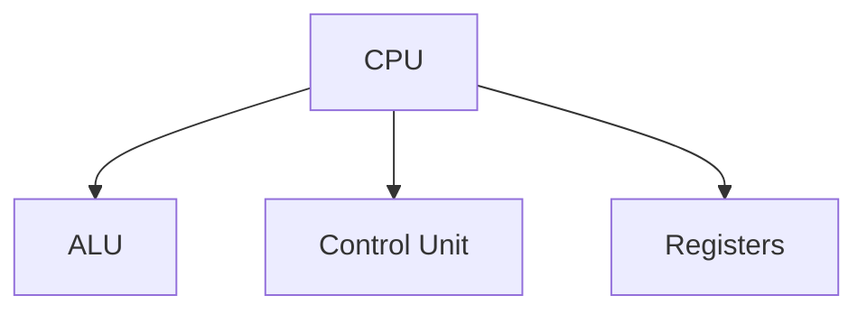
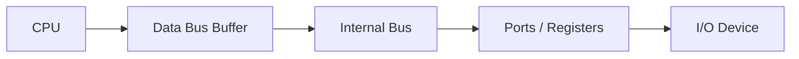
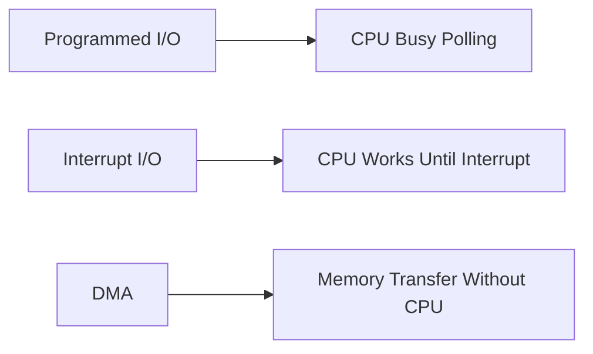
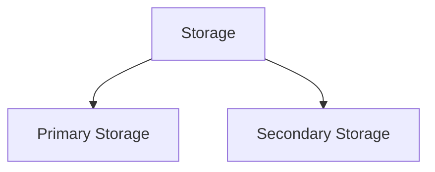
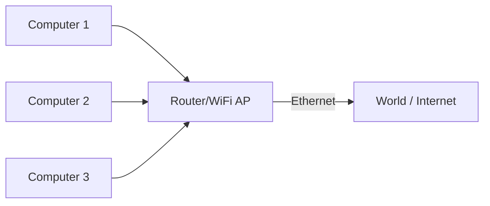
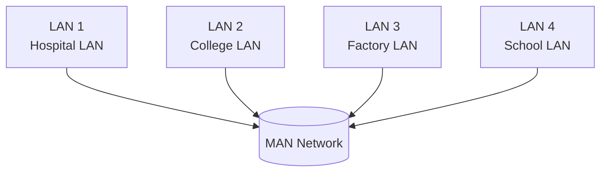
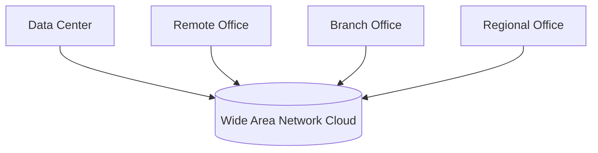

# Unit 2. Basic organisation and Networking fundamentals
- Computer Organization: Functional components – Input/Output devices, Storage types, Memory hierarchy.
- Types of Computers: Micro, Mini, Mainframe, and Supercomputers.
- Networking Fundamentals: Definition, need for networks, types (LAN, WAN, MAN), topology (Star, Ring, Bus).
- Internet Basics: IP Address, Domain Name, Web Browser, Email, WWW.

# Computer Organization
Computer Organization refers to the operational structure of a computer system. It explains:
* how hardware components work,
* how they communicate with each other,
* how a computer executes instructions internally.

# Functional units
* Input Unit
* Output Unit
* CPU
* Memory
* Storage Devices

Number System
* Binary (2)
* Octal (8)
* Decimal (10)
* Hexadecimal (16)
* Conversions & Complements

Memory Organisation
* RAM
* ROM
* Cache
* Memory Hierarchy

```mermaid
flowchart TB
  A[CPU / Registers] --> B[Cache]
  B --> C[Main Memory (RAM)]
  C --> D[Secondary Storage (HDD/SSD)]
  D --> E[Archive Storage / Cloud]
```

Input/Output Organisation
Includes:
* I/O Interfaces
* I/O Techniques (Programmed I/O, Interrupt, DMA)

CPU Organisation
1. Registers
2. Instruction Cycle
3. Addressing Modes
4. Instruction Formats

CPU Components


ALU Arithmetic logical unit 
* Arithmetic (+, −, ×, ÷)
* Logical (AND, OR, NOT, comparisons)

Control Unit
* Controls all components
* Fetch → Decode → Execute
* Maintains execution sequence

Registers
* Fastest memory inside CPU
* Stores data, instructions, addresses
* Examples: PC, ACC, IR

I/O Interfaces
Components
* I/O Module
* Buffers
* Control signals

Functions
* Communication bridge
* Speed & synchronization
* Data conversion
* Control & management
* Error checking



# I/O Techniques
1. Programmed I/O
* CPU polls device continuously
* CPU waits until device is ready

2. Interrupt-driven I/O
* CPU issues command
* Device interrupts CPU when ready

3. DMA
* DMA controller transfers data directly between memory & device
* CPU is free for other tasks



# Storage Unit Types
1. Primary Storage
* RAM, ROM
* Fast, ++directly CPU accessible++

2. Secondary Storage
* HDD, SSD.
* ++Larger but slower++



# Memory hierarchy

# Types of Computers

# Networking Fundamentals

Definition of a Network
A network is a collection of interconnected devices that:
* exchange data,
* share resources,
* use communication links & protocols (rules)

# Why Networks Are Needed?
* ==Resource sharing
* Communication & collaboration==
* Central services
* Scalability
* Remote access & mobility
* Performance
* Security
* ==Business continuity==

**Types of Networks**

1. LAN (Local Area Network)




2. MAN (Metropolitan Area Network)



3. WAN (Wide Area Network)



# Topologies
A network topology is the arrangement of devices (nodes) and connections (links) in a computer network. It shows how computers, servers, and other devices are connected and how data flows between them. There are two main types of topology:
1. Physical Topology: The actual physical layout of cables and devices.
2.Logical Topology: How data moves across the network, regardless of physical layout. 


# Internet Basics
