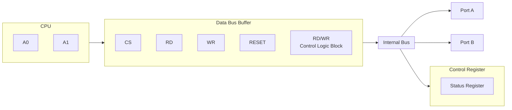
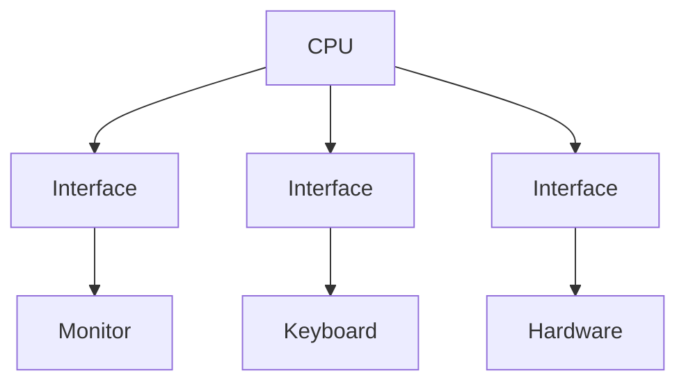
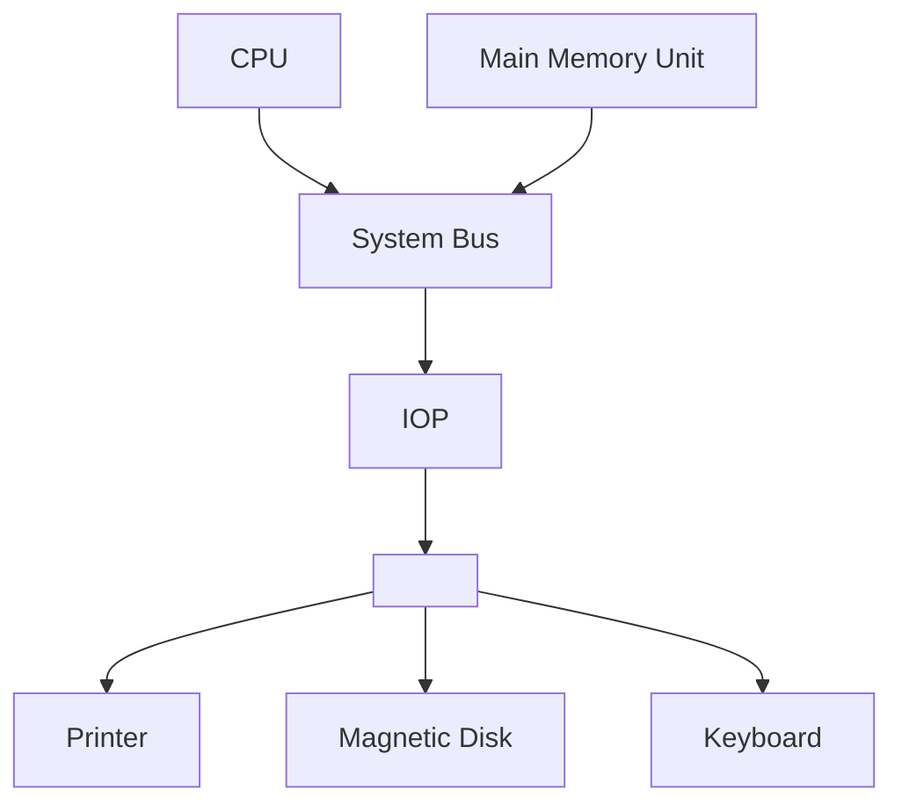
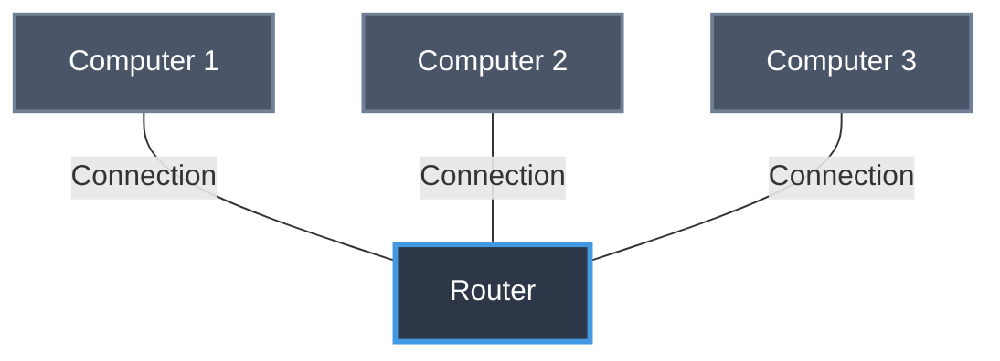
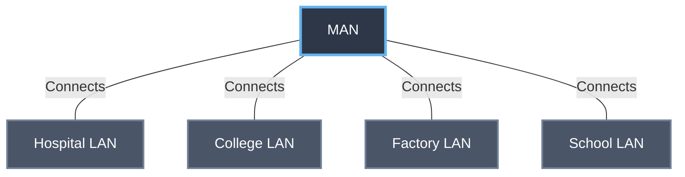
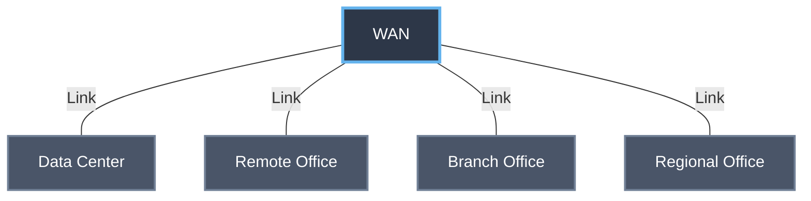
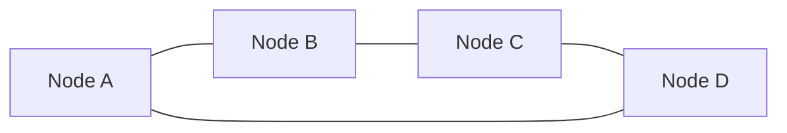
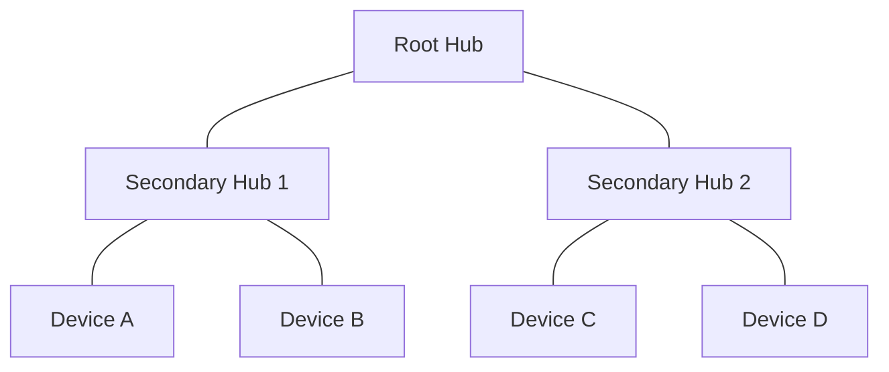

# Unit 2. Basic organisation and Networking fundamentals
- Computer Organization: Functional components – Input/Output devices, Storage types, Memory hierarchy.
- Types of Computers: Micro, Mini, Mainframe, and Supercomputers.
- Networking Fundamentals: Definition, need for networks, types (LAN, WAN, MAN), topology (Star, Ring, Bus).
- Internet Basics: IP Address, Domain Name or DNS, Web Browser, Email, WWW.

# Computer Organization
Computer Organization refers to the operational structure of a Computer system. It explains how hardware components work, how they communicate with each other, and how a Computer execute instructions internally.

C.O includes functional units of Computer: 
- Input unit, Output unit, CPU, Memory, Storage devices.
- Number System:
- Binary (2)
- Octal (8)
- Decimal (10)
- Hexadecimal (16)
- Conversions and Complements.
> [!tip]
> (xx) = base.
- Memory Organization: 
- RAM
- ROM
- Cache
- Memory Hierarchy



CPU Organisation:
1. Registers
2. Instruction Cycle
3. Addressing Modes
4. Instruction formats

Data transfer and Control:
1. Control System
2. Bus Control System

# Functional Components
1. Input devices:
* Takes data & instructions from the user & external environment
* Converts them into a machine readable (Binary format 1’s and 0’s.)
* Sends the converted data to the computer's memory or processor.
> [!example]
> Keyboard, Mouse, Scanner, Microphone, Touch screen.
2. Output Unit
* Takes processed results from the computer.
* Converts Machine readable data into a human understandable form.
* Displays *or* Outputs the data.
> [!example]
> Monitor, Printer, Speakers, Projector etc.
3. Storage/memory Unit:
Used to store ++data and instructions either temporarily or permanently.++ It is of 2 types:

I Primary Storage: ++Fast, directly accessible by CPU.++
> [!example]
> RAM and ROM.
II Secondary Storage: ++Large Capacity, Slower not directly accessed by CPU.++
> [!example]
> HDD, SSD, SD cards.
4. Central Processing Unit (CPU) ==++The CPU is the brain of the computer++== It has 2 major Sub-units:

I. Arithmetic Logic Unit (ALU): Performs Arithmetic operations and Logical operations. Arithmetic: -, +, \, x. Logic (AND, OR, NOT, Comparisons) and & !.

II. Control Unit:
- Controls and Coordinates all Components.
- Fetches, decodes and executes instructions.
- Maintain the sequence of operations.

III. Registers: Smallest and fastest memory locations in CPU temporarily hold data, instructions, addresses.
> [!example]
> PC, ACC, Instructions Register (IR).

IV. Interfaces:
Since CPU and I/O devices work at different speeds but interface helps in communication Components.
1. I/O Module
2. Buffer
3. Control Signals

I/O Functions:
1. Communication Bridge
2. Speed and Synchronization
3. Data Conversion
4. Control & Management
5. Error Checking


I/O Techniques
1. Programmed I/O
2. Interrupt-driven 
3. DMA.

I. Programmed I/O
* The CPU executes every instructions for an I/O operation.
* The CPU must continuously Poll or check, the status of a device to see if it is ready to transfer data.

II. Interrupt-driven I/O
- The CPU issues a command & then moves on the other tasks.
- When the I/O device ready to transfer data, it sends an interrupt signal to the CPU.

III. D.M.A
- Refers to ++Direct Memory Access++
- A dedicated DMA Controller handles the transfer of data ++between devices & memory, by passing the CPU entirely for the transfer itself.++
- This is the most efficient method for large data transfers, as it frees up the CPU to focus on other tasks while the data is being moved.



Computer Architecture main Components:
- CPU
- Main Memory Unit
- System Bus
- I/O & I/O Processors
- Printers
- Magnetic Disk (HDD)
- Keyboard

# Types of I/O & Storage devices
1. Primary Memory: It is also known as internal memory and main memory. This is a section of the CPU that holds program instructions, input data, and intermediate results. It is generally smaller in size. RAM (Random Access Memory) and ROM (Read Only Memory) are examples of primary storage.
2. Secondary Memory: Secondary storage is a memory that is stored external to the computer.  It is mainly used for the permanent and long-term storage of programs and data. Hard Disks, CDs, DVDs, Pen/Flash drives, SSD, etc, are examples of secondary storage.
3. Tertiary Memory: Tertiary Memory is a type of Memory that is rarely used in personal computers and due to this, tertiary memory is not considered to be an important one. Tertiary memory works automatically without human intervention.

RAM: It stands for Random Access Memory. It is used to store information that is used immediately or we can say that it is a temporary memory. Computers bring the software installed on a hard disk to RAM to process it and to be used by the user. Once, the computer is turned off, the data is deleted. With the help of RAM, computers can perform multiple tasks like loading applications, browsing the web, editing a spreadsheet, experiencing the newest game, etc. It allows you to modify quickly among these tasks, remembering where you're in one task once you switch to a different task. It is also used to load and run applications, like your spreadsheet program, answers commands, like all edits you made within the spreadsheet, or toggle between multiple programs, like once you left the spreadsheet to see the email. Memory is nearly always actively employed by your computer. It ranges from 1GB - 32GB/64GB depending upon the specifications. There are different types of RAM, and although they all serve the same purpose, the most common ones are : 
SRAM: It stands for Static Random Access Memory. It consists of circuits that retain stored information as long as the power supply is on. It is also known as volatile memory. It is used to build Cache memory. The access time of SRAM is lower and it is much faster as compared to DRAM but in terms of cost, it is costly as compared to DRAM.
DRAM: It stands for Dynamic Random Access Memory. It is used to store binary bits in the form of electrical charges that are applied to capacitors. The access time of DRAM is slower as compared to SRAM but it is cheaper than SRAM and has a high packaging density.
SDRAM: It stands for Synchronous Dynamic Random Access Memory. It is faster than DRAM. It is widely used in computers and others. After SDRAM was introduced, the upgraded version of double data rate RAM, i.e., DDR1, DDR2, DDR3, and DDR4 was entered into the market and widely used in home/office desktops and laptops.
ROM: It stands for Read-Only Memory. The data written or stored in these devices are non-volatile, i.e, once the data is stored in the memory cannot be modified or deleted. The memory from which will only read but cannot write it. This type of memory is non-volatile. The information is stored permanently during manufacture only once. ROM stores instructions that are used to start a computer. This operation is referred to as bootstrap. It is also used in other electronic items like washers and microwaves. ROM chips can only store a few megabytes (MB) of data, which ranges between 4 and 8 MB per ROM chip. There are two types of ROM: 
PROM: PROM is Programmable Read-Only Memory. These are ROMs that can be programmed. A special PROM programmer is employed to enter the program on the PROM. Once the chip has been programmed, information on the PROM can't be altered. PROM is non-volatile, that is data is not lost when power is switched off.
EPROM: Another sort of memory is the Erasable Programmable Read-Only Memory. It is possible to erase the info which has been previously stored on an EPROM and write new data onto the chip.
EEPROM: EEPROM is Electrically erasable programmable read-only memory. Here, data can be erased without using ultraviolet light, with the use of just applying the electric field.
Primary Storage Devices 

2. Magnetic Storage Devices
Floppy Disk: Floppy Disk is also known as a floppy diskette. It is generally used on a personal computer to store data externally. A Floppy disk is made up of a plastic cartridge and secured with a protective case. Nowadays floppy disk is replaced by new and effective storage devices like USB, etc.
Hard Disk: Hard Disk is a storage device (HDD) that stores and retrieves data using magnetic storage. It is a non-volatile storage device that can be modified or deleted n number of times without any problem. Most computers and laptops have HDDs as their secondary storage device. It is actually a set of stacked disks, just like phonograph records. In every hard disk, the data is recorded electromagnetically in concentric circles or we can say track present on the hard disk, and with the help of a head just like a phonograph arm(but fixed in a position) to read the information present on the track. The read-write speed of HDDs is not so fast but decent. It ranges from a few GBs to a few and more TB.
Magnetic Card: It is a card in which data is stored by modifying or rearranging the magnetism of tiny iron-based magnetic particles present on the band of the card. It is also known as a swipe card. It is used like a passcode(to enter the house or hotel room), credit card, identity card, etc. 
Tape Cassette: It is also known as a music cassette. It is a rectangular flat container in which the data is stored in an analog magnetic tape. It is generally used to store audio recordings. 
SuperDisk: It is also called LS-240 and LS-120. It is introduced by Imation Corporation and it is popular with OEM computers. It can store data up to 240 MB. 
Magnetic Storage Devices
Magnetic Storage Devices
3. Flash Memory Devices
It is a cheaper and more portable storage device. It is the most commonly used device to store data because is more reliable and efficient as compared to other storage devices. Some of the commonly used flash memory devices are:

Pen Drive: It is also known as a USB flash drive that includes flash memory with an integrated USB interface. We can directly connect these devices to our computers and laptops and read/write data into them in a much faster and more efficient way. These devices are very portable. It ranges from 1GB to 256GB generally.
SSD: It stands for Solid State Drive, a mass storage device like HDD. It is more durable because it does not contain optical disks inside like hard disks. It needs less power as compared to hard disks, is lightweight, and has 10x faster read and writes speed as compared to hard disks. But, these are costly as well. While SSDs serve an equivalent function as hard drives, their internal components are much different. Unlike hard drives, SSDs don't have any moving parts and thus they're called solid-state drives. Instead of storing data on magnetic platters, SSDs store data using non-volatile storage. Since SSDs haven't any moving parts, they do not need to "spin up". It ranges from 150GB to a few more TB.
SD Card: It is known as a Secure Digital Card. It is generally used with electronic devices like phones, digital cameras, etc. to store larger data. It is portable and the size of the SD card is also small so that it can easily fit into electronic devices. It is available in different sizes like 2GB, 4GB, 8GB, etc.
Memory Card: It is generally used in digital cameras. printers, game consoles, etc. It is also used to store large amounts of data and is available in different sizes. To run a memory card on a computer you require a separate memory card reader.  
Multimedia Card: It is also known as MMC. It is an integrated circuit that is generally used in-car radios, digital cameras, etc. It is an external device to store data/information.
Flash Memory Devices
Flash Memory Devices
 

# Memory Hierarchy
In the Computer System Design, Memory Hierarchy is an enhancement to organize the memory such that it can minimize the access time. The Memory Hierarchy was developed based on a program behavior known as locality of references (same data or nearby data is likely to be accessed again and again). The figure below clearly demonstrates the different
levels of the memory hierarchy.

# Why Memory Hierarchy is Required in the System? 
Memory Hierarchy helps in optimizing the memory available in the computer. There are ++multiple levels present in the memory, each one having a different size, different cost, etc... ++Some types of memory like cache, and main memory are faster as compared to other types of memory but they are having a little less size and are also costly whereas some memory has alittle higher storage value, but they are a little slower. Accessing of data is not similar in all types of memory, some have faster access whereas some have slower access.++

# Types of Memory Hierarchy
This Memory Hierarchy Design is divided into 2 main types:
- External Memory or Secondary Memory: Comprising of Magnetic Disk, Optical Disk, and Magnetic Tape i.e. peripheral storage devices which are accessible by the processor via an I/O Module.
- Internal Memory or Primary Memory: Comprising of Main Memory, Cache Memory & CPU registers. This is directly accessible by the processor.


Memory Hierarchy Design
1. Registers are small, high-speed memory units located in the CPU. They are used to store the most frequently used data and instructions. Registers have the fastest access time and the smallest storage capacity, typically ranging from 16 to 64 bits.
2. Cache Memory is a small, fast memory unit located close to the CPU. It stores frequently used data and instructions that have been recently accessed from the main memory. Cache memory is designed to minimize the time it takes to access data by providing the CPU with quick access to frequently used data.
3. Main Memory also known as RAM, is the primary memory of a Computer system. It has a larger storage capacity than cache memory, but it is slower. Main memory is used to store data and instructions that are currently in use by the CPU.

# Types of Main Memory:
- Static RAM Static RAM stores the binary information in flip flops and information remains valid until power is supplied. Static RAM has a faster access time and is used in implementing cache memory.
- Dynamic RAM: It stores the binary information as a charge on the capacitor. It requires refreshing circuitry to maintain the charge on the capacitors after a few milliseconds. It contains more memory cells per unit area as compared to SRAM.
4. Secondary Storage, such as hard disk drives (HDD) and solid-state drives (SSD), is a non-volatile memory unit that has a larger storage capacity than main memory. It is used to store data and instructions that are not currently in use by the CPU. Secondary storage has the slowest access time and is typically the least expensive type of memory in the memory hierarchy.
5. Magnetic Disk are simply circular plates that are fabricated with either a metal or a plastic or a magnetized material. The Magnetic disks work at a high speed inside the computer and these are frequently used. Magnetic disks is Obsolete in favor of Cloud storage and improvements in technologies such as USB Drives, SD cards. However, they are used in the entertainment industry for "Extra/Special edition" content in addition to the content.  
6. Magnetic Tape is simply a magnetic recording device that is covered with a plastic film. Magnetic Tape is generally used for the backup of data. In the case of a magnetic tape, the access time for a computer is a little slower and therefore, it requires some amount of time for accessing the strip. This old tech from 90s noone uses.

# Types of Computers
Computer are generally classified by speed, memory size and power consumption
- Micro computer: It is based on microprocessor chip as CPU. This is smallest category of Digital Computer.
- Mini Computer: A multi-user computer capable of supporting up to hundreds of users simultaneously. These computers are bigger in size and costlier than Microcomputers. Minicomputers are used in universities and big organisations.
- Mainframe computer: A mainframe computer is a very large computer capable of handling and processing very large amounts of data quickly. These are used by large institutions, such as government agencies and large corporations.
- Supercomputers Or High Performance Computer (HPC): A supercomputer is typically used for scientific and engineering 
applications that must handle very large databases. It is an extremely fast computer that can perform hundreds of millions of instructions per second. The speed of the supercomputer are measured by FLOPS (Floating point operations per second)

# Networking Fundamentals

Definition of Network-
A Computer network is a connection of interconnected devices (Computers, Printers, Routers, Phones, Switches, servers, devices etc....) that can exchange data and share resources using communication links and agreed rules (Protocols). Network allows devices to communicate both locally and across long distances ==forming the bases for services like email, web browsing, file sharing, streaming & remote access.==

# Why Networks are Needed?
1. Resource Sharing: Share Printers, Scanner, Network attached storage (NAS), Software licenses and databases centrally Reduces Duplication and Cost.++
2. Communication and Collaboration: Email, instant messaging, video conferencing Collaborative editing (Google Docs, MS 365).
3. Centralises Data Management and Backup: Central serves make backups, updates access control and audits easier.
4. Scalability and Flexibility New devices can be added with minimal configuration. Depending on Topology/Protocols (rules)
5. Remote access and mobility VPN’s, Wi-Fi and cloud services allow access from remote locations and mobile devices.
6. Performance and Efficiency: Local networks (LANs) provide low latency High throughput access to local resources
7. Security and Control: Fire Walls, IDS/access Policies and Central authentication.
> [!example]
> LDAP, active directory.
8. Business Continuity: Redundant network Paths laid over and WAN Support high availability.

# Local Area Networks (LAN)
- Area: Single building/office/home (Meters to few Kms)
- Speed: High (100 Mbps - 100 Gbps)
* Technologies: Ethernet (IEEE 802.3) WiFi (IEEE 802.11) Power line)
- Devices: Switches wireless APs, routers (edge), NICs
- User cases: Office networks, Campus labs, home network


# Metropolitan Area Network (MAN)
- Area: City large Campus a metro area (a few 10's of Km's)
- Speed: Medium to high (10's of mbps to multiple Gbps)
- Ownership: Can be Private (University) or Provided by a telecom/City provider
- Technologies: Metro Ethernet, fiber rings. Microwave links, leased lines
- Use Cases: Interconnecting branch offices within cities, Campus networking spanning multiple buildings




# Wide Area Network (WAN)
* Area: Inter city national & global - The Internet is the Largest WAN
* Speed: Variable (mbps to gbps); often higher than LAN
- Ownership Usually heterogeneous links leased from telecos, ISPs, Satellite Providers.
- Technologies MPLS, ATM (Legacy) leased lines, DSL, Fiber-Optic, Satellite/Cellular (5G/4G)
- Use Cases Connecting geographically dispersed branches, Internet, transport.
- Characteristic features Routing across, multiple administrative domains, complex QOS often secure tunnels (VPN) for private traffic.


# Topologies
In A network Topology is the arrangement of Devices (nodes) & Connections (links). In a Computer network. It shows how computers, servers, and other devices are connected and how data flows b/w them 
There are 2 types of Topologies:
1.  **Physical Topology**: The actual Physical layout of Cables and devices.
2. **Logical Topology**: How data moves across the network, regardless of physical layout

# P Topology (Point-to-Point): 
Point-to-point topology is a type of topology that works on the functionality of the sender and receiver. It is the simplest communication between two nodes, in which one is the sender and the other one is the receiver. Point-to-Point provides high bandwidth.
````  mermaid
graph LR
  A[Node A] --- B[Node B]
  %% Point-to-point: single dedicated link between two nodes
````
# Mesh Topology
In a mesh topology, every device is connected to another device via a particular channel. Every device is connected to another via dedicated channels. These channels are known as links. In Mesh Topology, the protocols used are AHCP (Ad Hoc Configuration Protocols), DHCP (Dynamic Host Configuration Protocol), etc.
````  mermaid
graph LR
  A[Node A] --- B[Node B]
  A --- C[Node C]
  A --- D[Node D]
  B --- C
  B --- D
  C --- D
  %% Full mesh: every node connected to every other node

````

# Star Topology
All the devices are connected to a single hub through a cable. *This hub is the central node and all other nodes are connected to central node.*
* The hub can be passive in nature - that is an intelligent hub such as broadcasting devices.
* At the same time the hub can be intelligent - known as an active hub. 
Active hubs have repeaters in them.

````  mermaid
graph LR
  Hub[Central Hub / Switch]
  A[Node A] --- Hub
  B[Node B] --- Hub
  C[Node C] --- Hub
  D[Node D] --- Hub
  %% Star: central hub with spokes to each device

````
# Bus Topology
Bus Topology is a network type in which every computer and network device is connected to a single cable. It is a multi-point connection and a non-robust topology because if the back bone fails the topology crashes.

````  mermaid
graph LR
  Backbone[Backbone Cable]
  Backbone --- A[Device A]
  Backbone --- B[Device B]
  Backbone --- C[Device C]
  Backbone --- D[Device D]
  %% Bus: single shared backbone with drop lines to devices

````
# Ring Topology
- It forms a ring connecting devices with exactly two neighboring devices.
- A no. of repeaters are used for Ring Topology with a large no. of nodes.
- In Ring Topology, the token passing protocol is used by the workstations to transmit the data. 
token passing is a network access method in which a special bit pattern called a token circulates around the ring. 
Token and Token in Ring Topology Token and Token is a frame that circulates around the network operations in Ring Topology.

Token Operations:
1) One Station is Known as a monitor station.
2) To transmit the data, the station has to hold the token. Transmission is Completed then the token will released to the other station.
3) When no station is transmitting the data, then the token will circulate in the ring.



# Tree Topology
Tree Topology is the variation of Star Topology. This Topology has an hierarchical flow of data.
- Various Secondary Hubs are connected to the Central Hub which contains the repeater.
- This data flows from top to bottom i.e,. from the Central Hub to the Secondary Hubs and then to the devices (or) from bottom to top that is i.e., devices to the secondary hub & then to the Central hub.
It is a multi-point connection & a non-robust topology because if the backbone fails the topology crashes.



# Internet basics
# What is Internet?
The Internet is a global network of interconnected computers & devices that allows users to access and share information & devices allowing them to communicate and exchange data. 
It enables users to access a wide range of services such as:
1. Websites
2. Emails
3. ++Social Media++
4. Online applications
5. Cloud storage

Initial tools for World Wide Web
1. +++Education++
2. +++Business++
3. Entertainment
4. Personal Communication

Network Protocol: 
A network Protocol is a set of rules that govern data communication between different devices in a Network.

Types of Network Protocols:
1. Network Communication
2. Network Management
3. Network Security

Network Communication Communication Protocols are really important for the functioning of a network:
- These Protocols formally set out of rules & format through which data is transferred.
- These protocols handle Syntax, Semantics, Error-detection etc.

# Network Communication Protocols
1 HTTP Hyper Text Transfer Protocol:
- 7-layer Protocol
- Used to transfer data
- Works on Client Server Model
2) TCP Transmission Control Protocol:
- Connection Oriented Protocol & reliable
- Used for Communication over a network
- Many applications, such as emails, FTP etc...
3) UDP User Datagram Protocol:
- It is a Connectionless layout Protocol that layout a basic but unreliable message service.
- UDP adds no flow Control, reliability or error recovery functions.
4) Internet Protocol (IP):

# What is Internet?
The Internet is a global network of interconnected Computers & devices that allows users to access and share informations & devices, allowing them to communicate and exchange data. It enables uses to access a wide range of services such as:
1) Websites
2) Emails
3) Social Media
4) Online applications
5) Cloud storage

Essential tools for World Wide Web
1) Education
2) Business
3) Entertainment
4) Personal Communication

Network Protocol: A network Protocol is a set of rules that govern data Communication btw different devices in a Network.
Types of Network Protocols:
1. Network Communication
2. Network Management
3. Network Security

Network Communications
Communication Protocols are really important for the functioning of a network.
* These Protocols formally set out rules & format through which data is transferred.
* These protocols handle Syntax, Semantics, Error-detection etc.

# Network Communication Protocols
# HTTP -> Hyper Text Transfer Protocol:
- 7-layer Protocol
- Used to transfer
- Works on client-server model

# TCP -> Transmission Control Protocol:
- Connection Oriented Protocol & reliable
- Used for Communication over a network
- Many applications, such as emails, FTP etc.

# UDP -> User Datagram Protocol:
- It is a Connectionless layout protocol that layout a basic but unreliable message service.
- It adds no flow control, reliability or error recovery functions.

# Internet Protocol (IP):
It is a Protocol through data is sent from one host to another the internet.
* It is used for addressing & routing data/packets so that they can reach their destination.

# Network Management:
These protocols assist in describing the procedures and policies that are used in monitoring, maintaining & managing computer network.
-> Used to communicating requesting requirements across the network.
-> Troubleshooting connections between host & a client

# Protocols:
* Internet Control Message Protocol (ICMP)
* Simple Network Management Protocol (SNMP)
* File Transfer Protocol (FTP).

# Network Security:
* These protocols secure the data in passage over a network.
* These protocols also determine how the network secures data from any unauthorized attempts.
To extract & review data.

# Protocols:
1) Secure Socket Layer (SSL)
2) Hypertext Transfer Protocol (HTTP)
3) Transport layer Security (TLS)

# IP Addresses:
An IP Address is an unique numerical label assigned to each device connected to a computer network that uses the Internet Protocol for communication.

Two main purposes:
1) Identifying a device on the network.
2) Locating the device to enable communication with other devices over a network like The Internet.


# Components of IP Address:
1. **Network Portion** - Identifies the network to which the device belongs to.
2. **Host Portion** - Identifies the individual device on the network.
3. **Subnet Mask (for IPv4)** - Defines which part of the IP is network which part is host.
> [!example]
IP 192.168.1.10 with subnet mask 255.255.255.0
- Network ID: 192.168.1.0
- Host ID: 10

# Versions of IP address
There are ++two++ versions of IP addresses.
1. IPv4 (Internet Protocol Version 4)
2. IPv6 (Internet Protocol Version 6)

# I IPv4
It is the first version of Internet Protocol address.
- The address size of IPv4 is a 32 bit number.
- In this version Internet Protocol Security for network security is optional.
- It has 4,294,967,296 addresses.
- It consists of 4 sets of numbers (octets) separated by dots.
- Each octet represents 8 bits or a byte & can take a value from zero to 255.
- This range is derived from the possible combinations of 8 bits ($2^8 = 256$ combinations).

IPv4 address format
85.107.80.23
1) ( ) (01010000) (11001111)
- 192.168.1.1
- $2^0$  $2^1$ $2^2$ $2^3$ $2^4$

# II IPv6
IPv6 addresses were created to deal with the shortage of IPv4 addresses.
- They use 128 bits instead of 32, offering a vastly greater no. of possible addresses.
- This address are expressed as 8 groups of 4 hexadecimal digits, each group representing 16 bits.
- The groups are separated by Colons:

`2001:0DCB:E004:0001:0000:0000:0001:F00A`


16 bits: 16 bits: 16 bits: 16 bits: 16 bits: 16 bits: 16 bits: 16 bits 128 bits - IPv6 Address format

# Types of IP Addresses:
1. **Public IP Address:** A public IP Address is assigned to every device that directly accesses internet.
- This address is unique across the entire internet.
- The address can be static or dynamic. i.e., can or can't be change.


2. **Private IP Addresses**: 
Private IP addresses are used within private network are not routable on the internet. This means that devices with Private IP addresses can’t directly communicate with devices on the internet without a translating mechanism - a router performing Network Address Translation Required Unique addresses.

Defined: range of IPv4
- 10.0.0.0 to 10.255.255.255
- 172.16.0.0 to 172.31.255.255
- 192.168.0.0 to 192.168.255.255

Defined range of IPv's
Addresses starting with 

1. **Static IP Address**
- Static IP Addresses are permanently assigned to a device typically, important for servers & devices that need a constant addresses.
- Reliable for network services that require regular access such as Websites, remote management.

2. **Dynamic IP Addresses**:
Temporarily assigned from a pool of available addresses by the Dynamic Host Configuration Protocol (DHCP) Cost effective & efficient for providers, perfect for consumer devices that do not require permanent addresses.

# Domain Name System
A Domain Name is a human readable name, "google.com", that is associated with the numerical IP addresses (e.g., 172.217.60.142) on a computer network. It is used to make it easier for people to access resources like websites and email addresses without having to remember complex IP address.

The Domain Name System (DNS) is the system that translates these domain names into IP addresses, much like a phone-book translates a person's name into a phone number.

It works as:
1. User Input: Domain name `www.google.com` sends a request to a DNS server.
2. DNS: DNS server translates the domain name into a Corresponding IP Address.
3. Connection: Computer uses IP Address to connect to the server hosting the website.
5. Result: Website is displayed on screen.

# Components of Domain Name
A domain name is structured hierarchically, with components separated by dots (.).
1. Top-level Domain (TLD): The last part of the name, such as: .com, .org, .net etc..
2. Second-level Domain (SLD): The name of the site itself, such as google in google.com.
3. Subdomain: A part of the domain that can be created by owner to organise the content, such as mail in "mail-google.com".

Features:
1.  **Memorability:** Easier to understand by humans to remember than long strings of numbers.
2.  **Functionality:** Computers with an IP address to communicate.
3.  **Organisation:** They allow for the organization of online services & resources.

# Web browser
- Web browser is an application software used to explore the WWW.
- It acts as a platform that allows users to access information from the internet by serving as an interface between the client (user) & the server.
- It acts as a The browser sends requests to servers for web documents.
images, links, styles & scripts.

Popular web browsers include:
1. **Google Chrome**: Developed by google, Chrome is one of the most widely-used web browsers in the world known for its speed & simplicity. SPYWARE.
2. **Mozilla Firefox**: Developed by mozilla foundation, Firefox is an open-source browser, known for its privacy features & customisations.
3. **Apple Safari**: Safari is the default browser on MAC & iOS known for speed integration.
4. **Microsoft Edge**: Edge is the default browser on windows 10 & known for its integration with other microsoft services & products. Internet Explorer
5. **Opera**: Opera is a web browser that is known for speed & built in VPN texture. CCP Spyware. 

Architecture of Web Browser


# Email
The email refers to electronic one means of communicating and receiving messages over the internet mail is the most common form of communication for Corporate offices, Government organizations and other "Important" work.

# Components of Email
**1. Sender:** The sender creates an email in which he records the information that needs to be transferred to the receiver.
2. **Receiver:** The receiver acts the information sent by the sender via email.
3. **Email addresses:** An email address is just like a house address where the communication arrives for the sender & receiver & they communicate with each other.
4. **Mailer:** A matter program Contains allows the ability to read, Write, Manage & delete.
5. Mail Servers: It is for responsible for sending, receiving managing & recording all the data Proceeded by their respective mail Programs & happen Proceeding them to their users.
6. **SMTP**: Simple mail Transfer Protocol. Uses the internet network connection to send receive email message over the internet.

Working of Email
Sender/Email Client → Network → Incoming/Outgoing Receiver/PC/Link → Network → Incoming Email / Outgoing Email -> Email Server


# World Wide Web (WWW)
The World Wide Web (WWW), often called the Web, is a system of interconnected
webpages and information that you can access using the Internet. It was created to help people share and find information easily, using links that connect different pages together. The Web allows us to browse websites, watch videos, shop online, and connect with others around the world through our computers and phones.  All public websites or web pages that people may access on their local computers and other devices through the internet are collectively known as the World Wide Web or W3. Users can get further information by navigating to links interconnecting these pages and documents. This data may be presented in text, picture, audio, or video formats on the internet.

# Key points
The Web has three main building blocks that make it work:
1. URL (Uniform Resource Locator): This is the address of a webpage, like https://www.example.com./ It tells your browser exactly where to find the page.
2. HTTP (Hypertext Transfer Protocol): This is the set of rules that lets your browser and the server talk to each other to send and receive webpages.
3. HTML (Hypertext Markup Language): This is the code that tells browsers how to display a webpage, including where to put text, pictures, and links.

Challenges of the Web
The Web is amazing, but it has some problems that you should know about:
- Privacy: Some websites collect information about you, like what you search for, and might share it without asking.
- Safety: Hackers can try to steal your information or send viruses through fake links or ads.
- False Information: Not everything on the Web is true, so you need to check if a website is trustworthy.
- Bullying: Some people use the Web to be mean or bully others, which can hurt feelings. NOT CAN it is a real thing.
- Too Much Screen Time: Spending too much time online can make it hard to focus on school or sleep well. Again NOT CAN it is a real thing
- Access Issues: Not everyone has fast Internet, especially in some countries, which makes it harder to use the Web.


